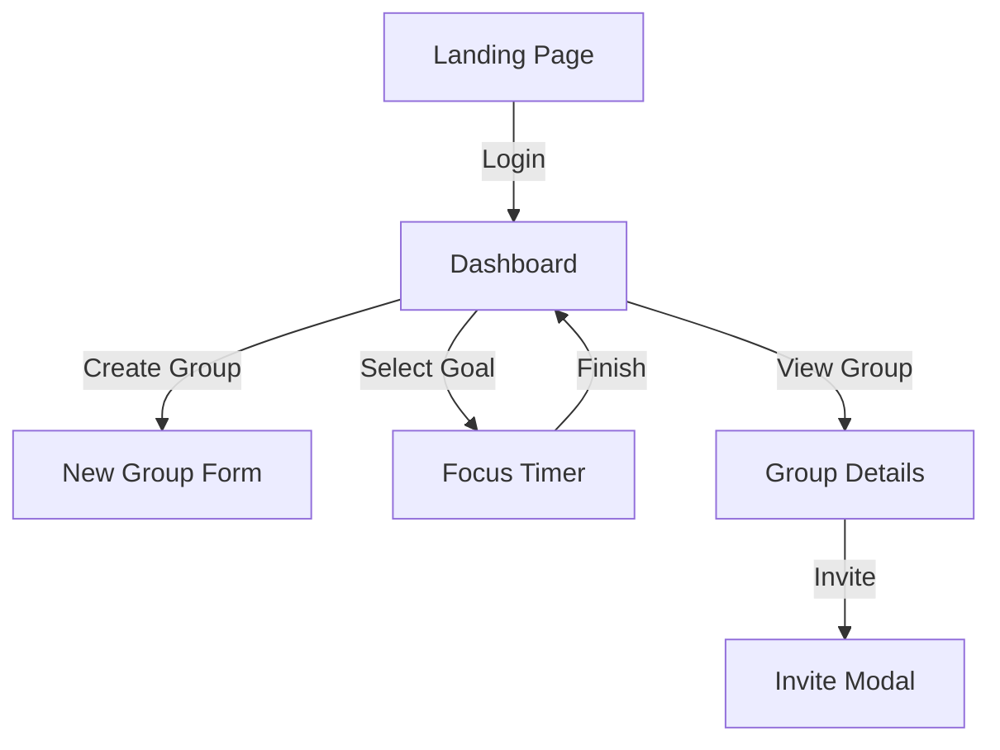

# Design Specification - Let's Meet Up

## User Scenarios

### 1. The "Commitment" (Group Creation)
**Scenario**: Alice wants to start a reading habit with Bob and Charlie.
1.  Alice creates a new Group: "Daily Readers".
2.  Alice adds a Goal: "Read for 30 minutes", "5 days / week".
3.  Alice invites Bob and Charlie (via link or email).
4.  **Outcome**: A shared space is created where everyone's progress starts at 0.

### 2. The "Daily Grind" (Check-in)
**Scenario**: Bob logs in to do his reading.
1.  Bob sees "Daily Readers" on his dashboard with a "0/30m" indicator.
2.  Bob clicks the item. It opens the **Focus/Timer View**.
3.  Bob hits "Start". The timer counts up.
4.  Bob gets a call after 15 minutes and hits "Pause".
5.  Later, he hits "Resume" and finishes the remaining 15 minutes.
6.  Upon completion, the app celebrates and marks the day as "Complete".
7.  **Outcome**: Bob's progress bar in the group view updates. Alice and Charlie see that Bob has finished.

### 3. The "Accountability" (Group View)
**Scenario**: Charlie checks how everyone is doing on Friday.
1.  Charlie opens the Group Details.
2.  He sees a **Weekly Heatmap** or **Grid**:
    *   Alice: [x] [x] [ ] [x] [ ]
    *   Bob:   [x] [x] [x] [x] [x] (Goal Met!)
    *   Charlie: [ ] [ ] [ ] [ ] [ ]
3.  Charlie feels motivated (or pressured) to catch up.

---

## Abstract Layouts (Wireframes)

### 1. Home Dashboard (`/dashboard`)
*   **Header**:
    *   Greeting ("Good Morning, Alice")
    *   Global Streak Fire Icon (optional)
*   **"Today's Action Items" (Priority List)**:
    *   List of goals that need attention *today*.
    *   *Card Style*: [Icon] [Goal Title] [Progress Bar 0/30m] [Play Button]
*   **"My Groups" (Overview)**:
    *   Grid of groups you belong to.
    *   Small status indicators.

### 2. Focus / Timer Screen (`/timer/[id]`)
*   **Visuals**: Clean, distraction-free. Dominant "Timer" text.
*   **Center**:
    *   **MM:SS** Display (Large).
    *   **Circular Progress** indicator.
*   **Controls**:
    *   [Play/Pause] (Primary Action - Floating Action Button style).
    *   [Stop/Finish] (Secondary).
*   **Feedback**:
    *   "You're doing great!" motivational text.

### 3. Group Detail View (`/groups/[id]`)
*   **Header**: Group Name & Description.
*   **The "Scoreboard"**:
    *   Table or Grid showing Members vs Days of Week.
    *   Cells are colored based on completion status (Green = Done, Grey = Pending).
*   **Activity Feed** (Optional):
    *   "Bob just finished reading for 30 mins."

## Navigation Flow

